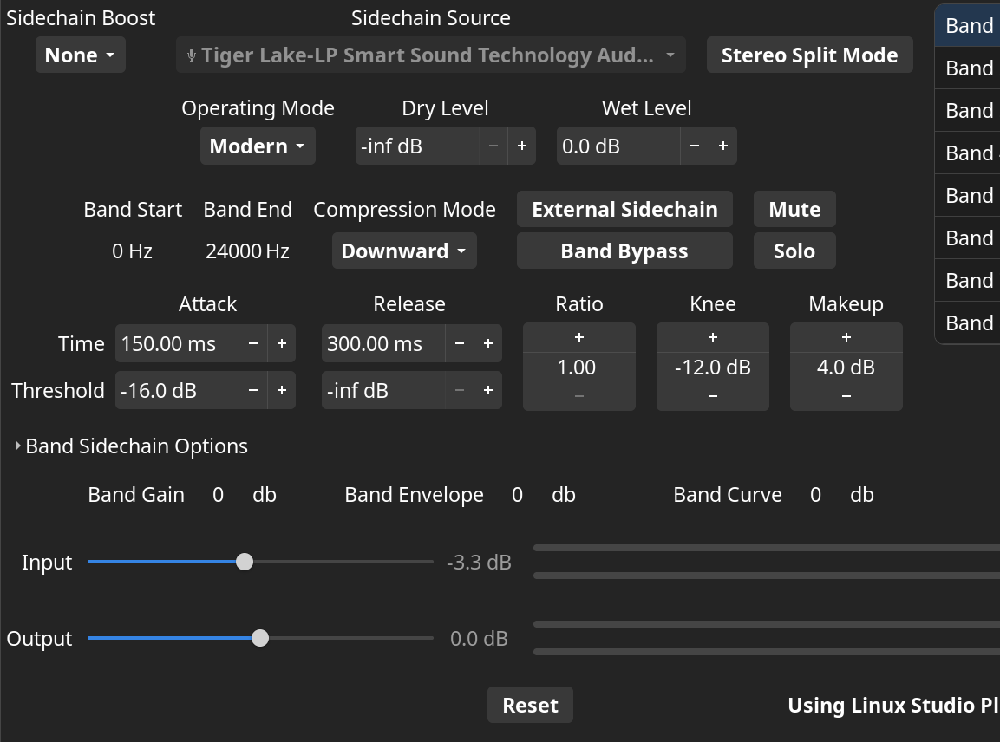

# Install-Manjaro-Linux-on-Matebook-X-Pro-2021-Huawei

## Description

This guide provides step-by-step instructions for installing Manjaro KDE on a Huawei Matebook X Pro 2021, configuring settings, and troubleshooting common issues that I have resolved on the way. You could use this guide as a reference to do the same in different Linux distributions. New suggestions would be welcome to improve this repo.

------

## Table of Contents

1. [Prerequisites](# Prerequisites)
2. [Preparing a USB flash drive for installation](# Preparing a USB flash drive for installation)
3. [Installation Guide](# Installation Guide)
4. [Post-Installation Configuration](# Post-Installation Configuration)
5. [Troubleshooting](# Troubleshooting)

## Prerequisites

- :cd: An empty USB drive with at least 8GB capacity.
- :computer_mouse: An external Mouse.
- :hourglass_flowing_sand: Time.


## Preparing a USB flash drive for installation

1. Your USB needs to have GPT Partition table before start, you could use **gparted** ([Instructions](https://artiya4u.medium.com/formatting-usb-flash-drive-for-macos-on-ubuntu-f445c6b052bb)) on Linux or [Mini Tool Partition Wizard](https://www.partitionwizard.com/free-partition-manager.html) ([Instructions](https://www.minitool.com/help-pw/convert-mbr-disk-to-gpt-disk.html)) on windows.

1. Download ISO File from here: https://manjaro.org/download/

2. To create the USB booteable you have 2 options GUI and CLI

	1. Creating using GUI tool:
	
	   > Download the [installer](https://etcher.balena.io/) to make the USB bootable or use CLI to install it (https://etcher-docs.balena.io/) and follow these [instructions](https://linuxmint-installation-guide.readthedocs.io/en/latest/burn.html#in-windows-mac-os-or-other-linux-distributions).
	   
	2. Using CLI without external tool (Only Linux):
	
	   Note: *Remember to change the **sdX** pointing to your usb device*
	   
	   > dd if=/path/to/your/file.iso of=/dev/sdX bs=4M status=progress


## Installation Guide

Change your BIOS Configuration using *F2 key* multiple times when you are powering-on and disable *Secure Boot* as you can see in the image below


Boot USB using *F12 key* multiple times when you are powering-on until you get a menu to select your USB drive to be booted:

Then you can change the language, timezone and keyboard depending on your needs and select **Boot with proprietary drivers**.

:exclamation:*If you select open source drivers you will get more configuration issues in the end of the installation such as flickering screen, touchpad is not recognized, boot not working, etc.*
	   


In the desktop screen you will notice the launchpad is not working, that's the reason you need a mouse to continue the installation process (*This issue you will have only for the installation not once you have installed it*). You could use the touch screen if you Matebook have it to replace the mouse but I'm not recommend it.

Open "Install Manjaro Linux" and continue as normal until *Partitions* section and select *Manual partitioning*. and create 3 partitions:

1. Swap Partition (4 GB) -> *Mount point: swap | File System: linuxswap | Flags: swap* 
2. Boot EFI (100 MB) -> *Mount Point: /boot/efi | File System: fat32 | Flags: boot*
3. Root (All free space) -> *Mount Point: / | File System: ext4 | Flags: root*

:exclamation:*Swap size that I assigned was because I'm not going to use Hibernation, you could visit this page for more [info](https://access.redhat.com/documentation/en-us/red_hat_enterprise_linux/6/html/installation_guide/s2-diskpartrecommend-x86)*.

You can see a graphical example with dual boot.


When you have created all partitions, continue with the last part of the installation, making user, password, etc to finish it. If you notice, the boot screen shows the Huawei Logo.


Once you have installed it for the first time, update it using

> sudo pacman -Syu

And install [YAY](https://itsfoss.com/install-yay-arch-linux/) for dealing with AUR packages.


## Post-Installation Configuration

We have chosen KDE as the Desktop Environment, so you could replicate my configurations on Gnome, XFCE, or whatever environment you choose.


### Display

The Screen Resolution looks so high, and everything looks tiny. To fix it go to:

> System Settings > Display and Monitor > Display Configuration

In the *Global Scale* option change it to *175%* and apply changes.


If you install new terminals, normally you can change the size using:

> ctrl + (+ key) or (- key)

(Optional) In case you have cursor, dolphin directories, icons and windows decoration buttons small, you need to change them:

> *Cursor*: System Settings > Appearance > Cursors > Size to 36
>
> *WD*: System Settings > Appearance > Windows Decorations > Pen Button > Button Size = Normal
>
> *Icons*: System Settings > Appearance > Icons > Configure Icon Sizes > Main Toolbar and  Secondary Toolbars > Size = **22**
>
> *Dolphin*: Open it > Configure > Configure Dolphin > View Modes > Icons > Default Icon Size = **32 pixels**


### Battery

These configurations you need to do since will avoid one bug that I explain in this section [SSDM BUG](# SDDM BUG (Black screen and Password Fail)) after fix it or decide something, you can change for your own confs.

To apply them go to:

> System Settings > Power Management > Energy Saving

*On AC Power, On Battery, On Low Battery Tabs:*

Deactivate **Suspend Session** and change the **When laptop lid closed** to "*Turn off screen*".

:exclamation:*The hibernation option after fix the bug only is used if you have a good swap size.*


### Touchpad

Moving the pointer is slow, and you need to increase the acceleration and invert the scroll direction if you want it as Windows do, in:

> System Settings > Input Devices > Touchpad

Increase **Pointer acceleration** to *0.20* and activate **invert scroll direction (Natural Scrolling)**


## Troubleshooting

---

### SDDM BUG (Black screen and Password Fail)

This bug happens when the computer enter to sleep or it is inactive, first time works, but multiple times the password is not recognized by SDDM and you cannot login again, and when the computer is inactive for long time the black screen shows up and you cannot do anything. To avoid them you need to make the changes I do in the [battery section](# Battery), but to fix it you have two options:

1. Fix the error

   I don't like sddm, so in my case it wasn't my solution, but I put references that could help you to fix it if you like it [link1](https://www.reddit.com/r/voidlinux/comments/wt7x68/kde_lock_screen_correct_password_not_accepted/) [link2](https://askubuntu.com/questions/909943/cant-unlock-lockscreen-sddm)

   

2. Change the Display Manager

   I love to use LightDM, since the login screen are so beautiful, so you can replace it following these instrucctions:

   - Install LightDM packages

     > sudo pacman -S lightdm lightdm-webkit2-greeter

   - Add webkit2 in the LightDM config file

     > nano /etc/lightdm/lightdm.conf
     >
     > 
     >
     > -- in the [Seat:*] section comment or add this line:
     >
     > greeter-session=lightdm-webkit2-greeter

   - Download whatever of these [themes](https://www.reddit.com/r/unixporn/comments/62l3gt/lightdmwebkit_theme_suggestions/), I'll use [litarvan](https://github.com/Litarvan/lightdm-webkit-theme-litarvan/releases/download/v3.2.0/lightdm-webkit-theme-litarvan-3.2.0.tar.gz) for this example, and extract the tar file:

     > mkdir litarvan && tar -xzvf lightdm-webkit-theme-litarvan-3.2.0.tar.gz  -C litarvan/ && sudo mv litarvan /usr/share/lightdm-webkit/themes/

   - Go to the webkit2 config file and change the variable to *webkit_theme =  litarvan*

     > nano /etc/lightdm/lightdm-webkit2-greeter.conf

   - Now comment the lines in the [KSplash] section and copy these ones:

     > [KSplash]
     > Engine=none
     > Theme=None

   - And change the service deactivating sddm and activating lightm

     > sudo systemctl disable sddm
     > sudo systemctl enable lightdm

   And that's all, you need to reboot and you will see the good themes that ligthdm have.


---

### Bad Sound / Not Sound

The quality of the audio is so bad when I reduce the volume less than 50% because the speakers change to other speakers and the quality is horrible. It's complicated to find solutions on internet about it, to fix this error firstly you need to know what driver and audio information you have:

> inxi -Aa


There are important things to notice in the output:

1. **Name Device:** *Intel Tiger Lake-LP Smart Sound Audio*

2. **Driver:** *sof-audio-pci-intel-tgl*

3. **Alternate:** *snd_had_intel* and *snd_sof_pci_intel_tgl*

4. **Chip-ID:** *8086:a0c8*


According on the [Linux Driver Database](https://cateee.net/lkddb/web-lkddb/SND_SOC_SOF_INTEL_TGL.html) my driver exists only in the following kernel versions:

- 5.12 to 5.19
- 6.0 to 6.6
- 6.7-rc+HEAD

So, if you don't have a kernel in these versions probably you don't have sound because driver not exists in the kernel, so you need to update it to one from the list. You can check the version with this command:

> uname -a

In case your kernel version is correct, it's important to know that your computer is "relative new" and many sof-firmwares are in the new packages, probably between 2021 until now "2023". This firmware is in the [sof-firmware package](https://archlinux.org/packages/extra/x86_64/sof-firmware/files/) as you can see.  You can install or reinstall the package and reboot using:

- Manjaro/Arch Linux

> sudo pacman -S sof-firmware

- Ubuntu

> sudo apt update && sudo apt install firmware-sof-signed


You could see these firmwares in your computer with this:

> ls /lib/firmware/intel/sof-tplg/sof-tgl*

These firmwares are provided by Sound Open Firmware. I'm not going to deep in this section because reviewing the firmwares for Matebook-X Pro 2021, it is using v2.1 sof-bin versions that is actual installed, so you don't need to install sof-bin AUR Package.

:exclamation:*Probably if you have a different architecture or your firmware is missing you would be interested on this [sof-bin repo](https://github.com/thesofproject/sof-bin) and get more info [here](https://forums.linuxmint.com/viewtopic.php?f=42&t=373391).*

It's normal that the problem persist of the bad sound with low volume, so you can run this:

> ls /usr/share/alsa/

And you will find the configurations that takes alsa for your driver in the "*ucm*" directory. The configurations inside not working for this computer so we have 2 options, "**remove them**" or "**find new configuration**". In my case I removed them and it works, but I will explain both situations


- Remove them

  Make a backup of your configurations and let the ucm directory empty.

  > mkdir backup_alsa_ucm && cd backup_alsa_ucm && sudo mv /usr/share/alsa/ucm2/* .

  In case your directory is called *ucm2* renamed to *ucm*

  >  mv /usr/share/alsa/ucm2/ /usr/share/alsa/ucm/

  And reboot the computer, check volume sound, if you notice the speakers and quality change when you reduce the volume, you need to find the new configurations otherwise you have fixed the error and only we need to increase the quality sound in this section: [increase quality sound section](# Increase Quality Sound).

  :exclamation: *Remember I mean bad quality because it's not the best but when you reduce the volume the quality is extremely horrible*

  

- Find new configuration

  Check this [ucm repository](https://github.com/thesofproject/alsa-ucm-conf/tree/master) and you will find configurations for many computers, clone it.

  > git clone https://github.com/thesofproject/alsa-ucm-conf.git --branch master

  As you can see this repository contains *ucm* empty and *ucm2* dirs with a lot of configurations, you need to replace the content of ucm2 with these new ones and reboot everytime.

  Firstly backup your ucm content:

  >mkdir backup_alsa_ucm && cd backup_alsa_ucm && sudo mv /usr/share/alsa/ucm2/ .

  Then you copy ucm configurations from repo to your local ucm2 and reboot:

  >sudo cp -R ucm2/* /usr/share/alsa/ucm2/

  To be sincere none configuration works for me from this master branch, but I noticed the repo contains different branches with different configurations, you need to try and check them out if one of them works. Also I haven't try if you only copy one directory to see how ALSA take the configurations instead of all of them at the same time.


---

### Increase Quality Sound

Now you can noticed your audio is not changing with the volume but it doesn't sound like Windows do, so for replicate a similar quality we need to install EasyEffects and their dependencies:

> sudo pacman -S pipewire pipewire-alsa pipewire-pulse wireplumber gst-plugin-pipewire easyeffects calf lsp-plugins zam-plugins-lv2 mda.lv2 yelp

I remember that you could have conflict dependencies or you cannot installed because of many packages, you need to uninstall them.

Then you need to enable EasyEffects to start with system, open EasyEffects and click on the button next to minimize window, select preferences and activate.


Select *Output* tab and *Effects* tab at the bottom, then in the *Presets* button next to *Output*, put a name and click on the *+ button* to create a new preset. After that add these 5 effects in this order then disable all with *power button* next to effect but "*limiter*":

1. Filter
2. Bass Enhancer
3. Multiband Compressor
4. Stereo Tools
5. Limiter

Every effect configuration you do, you need to go to the Presets button look at your new preset and next to Load there is a button to save it.

- Copy these configurations in *Limiter*:


- After that enable and configure *Filter*:


- Now enable and configure *Bass Enhancer*


- Enable and Configure *Multiband Compressor*, in this section you need to select *Band1* since the image below shows configuration for *Band1*, but you need to have different configurations for each band until Band4.

  Copy same configurations per band as following:

```
Band 1 Attack Time: 150 ms, Release Time: 300 ms, Attack Threshold: -16 dB, Ratio: 5Knee: -12 dB, Makeup: 4 dB

Band 2 Attack Time: 150 ms, Release Time: 200 ms, Attack Threshold: -24 dB, Ratio: 3Knee: -9 dBMakeup: 4 dB

Band 3, Attack Time: 100 ms, Release Time: 150 ms, Attack Threshold: -24 dB, Ratio: 3Knee: -9 dBMakeup: 4 dB

Band 4, Attack Time: 80 ms, Release Time: 120 ms, Attack Threshold: -24 dB, Ratio: 4Knee: -9 dBMakeup: 4 dB
```

sudo systemctl disable sddm
sudo systemctl enable lightdm

Now select the bands as the following image and save it.


- The last effect enable and configure *Stereo Tools*.


Save it again and now go to the *PipeWire* tab and in *General* option you will see our Driver Name *Tiger Lake-LP Smart Sound*, and you need to activate as default input and output. Then go to *Presets Autoloading*  and select our *Driver Tiger*, select your Preset you have created, and click on the *+ button*

:exclamation:*You can do the same for new devices that has the similar problem and create new presets for them*

You can try your new configurations and close EasyEffects, in case you don't get the new quality try to visit this article to get more [info](https://forum.manjaro.org/t/how-to-make-linux-sound-great/146143).


